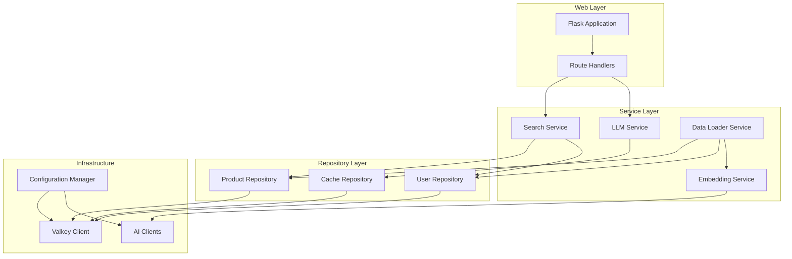

# Design Document

## Overview

This design document outlines the refactoring of the Valkey-powered personalized product search demo from a procedural approach to a clean, object-oriented architecture. The refactored system will maintain all existing functionality while providing better separation of concerns, improved testability, and enhanced maintainability.

The architecture follows the Repository pattern for data access, Service pattern for business logic, and Dependency Injection for loose coupling. The design ensures that the Flask application remains focused on HTTP concerns while delegating business logic to appropriate service classes.

## Architecture

### High-Level Architecture



### Design Principles

1. **Single Responsibility Principle**: Each class has one clear purpose
2. **Dependency Inversion**: High-level modules depend on abstractions, not concretions
3. **Interface Segregation**: Clients depend only on interfaces they use
4. **Open/Closed Principle**: Classes are open for extension, closed for modification

## Components and Interfaces

### Configuration Management

**ConfigurationManager Class**
- Centralizes all application configuration
- Supports environment variable overrides
- Provides typed configuration access
- Handles both GCP and local AI mode configuration

```python
class ConfigurationManager:
    def __init__(self):
        self.valkey_host: str
        self.valkey_port: int
        self.is_cluster: bool
        self.ai_mode: str  # "GCP" or "LOCAL"
        self.gcp_project: Optional[str]
        self.vector_dim: int
        # ... other config properties
    
    def load_from_environment(self) -> None
    def get_valkey_config(self) -> ValkeyConfig
    def get_ai_config(self) -> AIConfig
```

### Repository Layer

**Abstract Base Repository**
```python
from abc import ABC, abstractmethod
from typing import Optional, List, Dict, Any

class BaseRepository(ABC):
    def __init__(self, valkey_client):
        self.client = valkey_client
```

**UserRepository Class**
- Handles all user-related data operations
- Provides clean interface for user profile management
- Encapsulates user data serialization/deserialization

```python
class UserRepository(BaseRepository):
    def get_user_profile(self, user_id: str) -> Optional[UserProfile]
    def save_user_profile(self, user: UserProfile) -> bool
    def get_user_embedding(self, user_id: str) -> Optional[np.ndarray]
```

**ProductRepository Class**
- Manages product data operations
- Handles batch operations for data loading
- Provides search-optimized data access

```python
class ProductRepository(BaseRepository):
    def get_product_by_id(self, product_id: str) -> Optional[Product]
    def get_products_by_ids(self, product_ids: List[str]) -> List[Product]
    def save_product(self, product: Product) -> bool
    def save_products_batch(self, products: List[Product]) -> bool
    def get_product_embedding(self, product_id: str) -> Optional[np.ndarray]
    def search_products_by_tags(self, tags: List[str], limit: int) -> List[str]
```

**CacheRepository Class**
- Manages LLM response caching
- Handles cache expiration and cleanup
- Provides async cache operations

```python
class CacheRepository(BaseRepository):
    def get_cached_description(self, cache_key: str) -> Optional[str]
    def set_cached_description(self, cache_key: str, description: str, ttl: int) -> bool
    def exists(self, cache_key: str) -> bool
```

### Service Layer

**EmbeddingService Interface and Implementations**
- Abstract interface for embedding generation
- Separate implementations for GCP and local models
- Handles batch embedding generation

```python
from abc import ABC, abstractmethod

class EmbeddingService(ABC):
    @abstractmethod
    def generate_embeddings(self, texts: List[str]) -> List[np.ndarray]
    
    @abstractmethod
    def get_vector_dimension(self) -> int

class GCPEmbeddingService(EmbeddingService):
    def __init__(self, project: str, location: str, model_name: str)
    
class LocalEmbeddingService(EmbeddingService):
    def __init__(self, model_name: str)
```

**LLMService Interface and Implementations**
- Handles personalized description generation
- Manages async processing and caching
- Provides fallback mechanisms

```python
class LLMService(ABC):
    @abstractmethod
    def generate_personalized_description(self, user_profile: UserProfile, product: Product) -> str

class GCPLLMService(LLMService):
    def __init__(self, client, model_name: str, cache_repo: CacheRepository)
    
class LocalLLMService(LLMService):
    def __init__(self, model_name: str, cache_repo: CacheRepository)
```

**SearchService Class**
- Orchestrates product search operations
- Implements MMR reranking algorithm
- Combines keyword and vector search

```python
class SearchService:
    def __init__(self, product_repo: ProductRepository, user_repo: UserRepository):
        self.product_repo = product_repo
        self.user_repo = user_repo
    
    def search_products(self, user_id: str, query: str, limit: int = 5) -> List[Product]
    def get_similar_products(self, product_id: str, limit: int = 5) -> List[Product]
    def get_recommended_products(self, user_id: str, exclude_product_id: str = None, limit: int = 5) -> List[Product]
    def _mmr_rerank(self, query_embedding: np.ndarray, candidates: List[Tuple[str, np.ndarray]], lambda_param: float = 0.7, top_n: int = 5) -> List[str]
```

**DataLoaderService Class**
- Handles data loading and processing
- Manages batch operations for performance
- Provides progress tracking and error handling

```python
class DataLoaderService:
    def __init__(self, product_repo: ProductRepository, user_repo: UserRepository, embedding_service: EmbeddingService):
        self.product_repo = product_repo
        self.user_repo = user_repo
        self.embedding_service = embedding_service
    
    def load_products_from_csv(self, csv_paths: List[str], batch_size: int = 100) -> bool
    def load_personas_from_csv(self, csv_path: str) -> bool
    def create_search_index(self, index_name: str) -> bool
    def flush_database(self) -> bool
```

### Data Models

**UserProfile Class**
```python
@dataclass
class UserProfile:
    id: str
    name: str
    bio: str
    avatar: str
    embedding: Optional[np.ndarray] = None
    purchase_history: List[Dict] = field(default_factory=list)
```

**Product Class**
```python
@dataclass
class Product:
    id: str
    name: str
    brand: str
    main_category: str
    sub_category: str
    price: float
    original_price: float
    rating: float
    review_count: int
    link: str
    image_url: str
    region: str
    brand_tags: str
    search_tags: str
    embedding: Optional[np.ndarray] = None
```

### Utility Classes

**DataProcessor Class**
- Handles data cleaning and transformation
- Provides utility functions for text processing
- Generates tags and extracts brands

```python
class DataProcessor:
    @staticmethod
    def generate_tags(text: str, separator: str = ',') -> str
    
    @staticmethod
    def extract_brand(name: str) -> str
    
    @staticmethod
    def clean_numeric(val, to_type=float)
    
    @staticmethod
    def generate_avatar_data_uri(user_id: str) -> str
```

**ValkeyClientFactory Class**
- Creates appropriate Valkey client instances
- Handles both standalone and cluster configurations
- Provides connection validation

```python
class ValkeyClientFactory:
    @staticmethod
    def create_client(config: ValkeyConfig):
        # Returns either Valkey or ValkeyCluster instance
```

## Error Handling

### Custom Exception Hierarchy

```python
class ValkeySearchDemoException(Exception):
    """Base exception for the application"""
    pass

class ConfigurationError(ValkeySearchDemoException):
    """Raised when configuration is invalid"""
    pass

class DatabaseConnectionError(ValkeySearchDemoException):
    """Raised when database connection fails"""
    pass

class EmbeddingGenerationError(ValkeySearchDemoException):
    """Raised when embedding generation fails"""
    pass

class SearchError(ValkeySearchDemoException):
    """Raised when search operations fail"""
    pass
```

### Error Handling Strategy

1. **Service Layer**: Catches low-level exceptions and raises domain-specific exceptions
2. **Repository Layer**: Handles database connection issues and data validation errors
3. **Flask Layer**: Catches service exceptions and returns appropriate HTTP responses
4. **Logging**: Comprehensive logging at all levels with appropriate log levels

## Testing Strategy

### Unit Testing
- **Repository Tests**: Mock Valkey client, test data operations
- **Service Tests**: Mock repositories, test business logic
- **Utility Tests**: Test data processing functions

### Integration Testing
- **Database Integration**: Test with real Valkey instance
- **AI Integration**: Test with mock AI services
- **End-to-End**: Test complete workflows

### Test Structure
```
tests/
├── unit/
│   ├── repositories/
│   ├── services/
│   └── utils/
├── integration/
│   ├── database/
│   └── ai/
└── e2e/
    └── workflows/
```

## Migration Strategy

### Phase 1: Infrastructure Setup
1. Create configuration management system
2. Implement repository base classes
3. Set up dependency injection container

### Phase 2: Repository Layer
1. Implement UserRepository
2. Implement ProductRepository  
3. Implement CacheRepository
4. Add comprehensive tests

### Phase 3: Service Layer
1. Implement EmbeddingService variants
2. Implement LLMService variants
3. Implement SearchService
4. Implement DataLoaderService

### Phase 4: Application Integration
1. Refactor Flask application to use services
2. Update data loading script
3. Add error handling and logging
4. Performance testing and optimization

### Phase 5: Cleanup and Documentation
1. Remove old procedural code
2. Update documentation
3. Add code examples
4. Final testing and validation